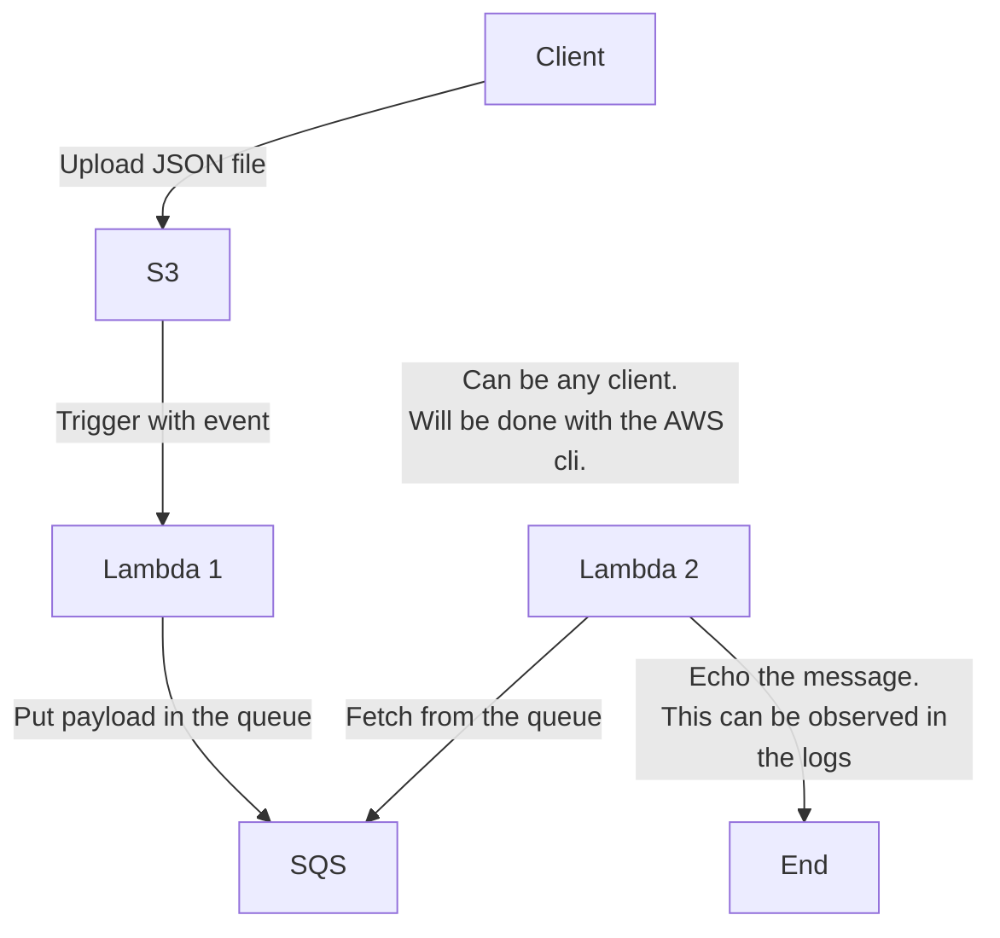

### Pipeline:

The infrastructure should be reproducible. Terraform is used to provision the needed components in AWS.

All components should have the needed permissions to do their job. Example: S3 needs to have permissions to trigger the lambda. Lambda should have permissions to put messages in the queue etc.
